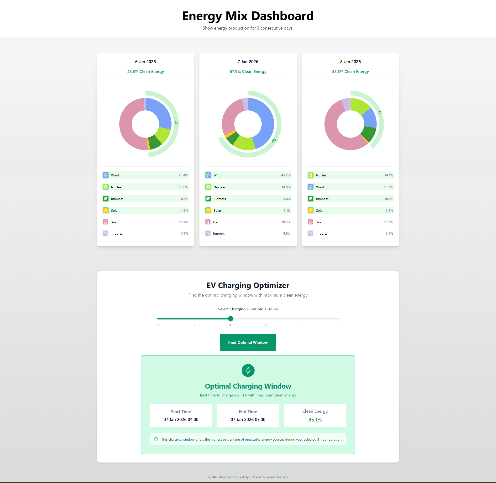
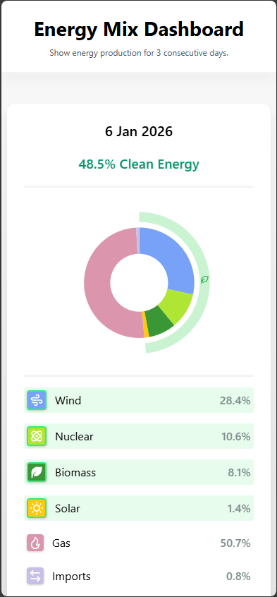
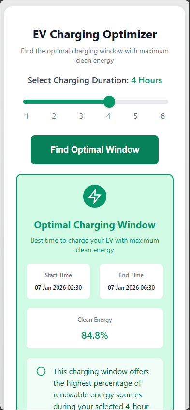

# Energy Mix Project

A full-stack solution for visualizing UK energy production data and calculating the most eco-friendly windows for EV charging. This project combines a React dashboard with a .NET 8 API.

## Live Demo

**[energy-mix-frontend-53hj.onrender.com](https://energy-mix-frontend-53hj.onrender.com)**
The app is hosted on Render's free tier so it may take ~15 seconds to fetch data on first load.

## Overview

Interactive donut charts display the daily energy breakdown, while the optimizer calculates exactly when to plug in EV to utilize the maximum percentage of clean energy.

## Screenshots



<p float="left">
  
  
</p>


## Monorepo Structure

This project is organized as a monorepo for seamless management and deployment:

```
/frontend: React 18 application built with TypeScript.
/backend: ASP.NET Core 8.0 Minimal API processing National Grid data.
/docs: Screenshots and documentation.
```
